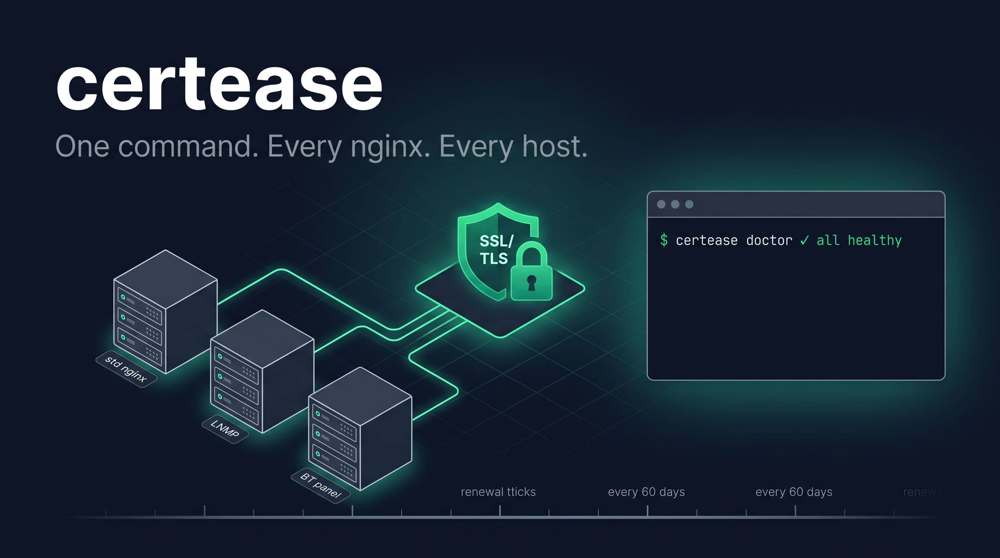

<div align="center">



# certease


[](https://github.com/tao-hpu/certease)

[🌐 English](README.md) | [🇨🇳 中文](README.zh.md)

**面向异构 Linux 机群的 ACME 证书轮换标准化工具。**

</div>


在 `acme.sh` 与 `certbot` 之上的轻量幂等 Bash 编排层。统一不同 nginx 部署方式（发行版包、LNMP 一键包、面板）下的 SSL 轮换流程：自动检测环境、安装一致的 cron、绑定经过校验的 reload 钩子，并通过单一 `doctor` 命令汇总机器状态。

---

## 适用场景

符合以下全部条件时，certease 能显著降低你的运维成本：

- 你管理**多台 Linux 服务器**，它们都通过 `acme.sh`（或 `acme.sh` 与 `certbot` 混用）完成 SSL 证书轮换。
- 这些服务器**异构**：nginx 安装来源不同（发行版包、LNMP 一键包、面板），webroot 不同，reload 命令不同。
- 你自己写过或让 AI 写过轮换脚本，但发现**每台机器最终的配置、cron 表达式、hook 路径与失败模式都略有差异**。
- 你希望用一条命令把任何新接手或新增的机器调到已知良好状态，再用一条命令检查整个机群的健康状况。

以下情况**不适合**使用 certease：

- 业务全部跑在 Docker 或 Kubernetes 上。请使用 Caddy 或 cert-manager。
- 证书由云厂商托管（AWS ACM、Cloudflare SSL）。无需源站轮换。
- 单台服务器且部署标准。`certbot` 配合 systemd timer 即可。

## 功能

| 命令 | 用途 |
|---|---|
| `bash install.sh` | 探测环境、写配置、装 cron、绑定 reload 钩子。幂等。 |
| `certease status` | 每张证书一行：工具、CA、到期日、剩余天数。 |
| `certease doctor` | 完整健康检查：cron、日志、钩子绑定、nginx 语法、孤儿目录、CA 账户邮箱。 |
| `certease renew [domain]` | 手动触发续签，失败自动回退到备用 CA（ZeroSSL → Let's Encrypt）。 |

## 它不做什么

- 不取代 `acme.sh` 或 `certbot`。它们仍然负责证书签发，certease 只做编排。
- 不处理 DNS-01 挑战。使用 `acme.sh` 原生 DNS 插件。
- 不接触证书内容。签发、验证、私钥管理全部交由底层工具。
- 不做 TLS 代理、缓存或终止。只通过 reload 钩子把证书投递到 nginx。

## 核心设计

**nginx flavor 自动识别。** 支持三种 flavor，路径互斥：

| Flavor | nginx 可执行文件 | SSL 部署目录 | 识别信号 |
|---|---|---|---|
| `std` | `/usr/sbin/nginx` | `/etc/nginx/ssl/` | 发行版包安装 |
| `lnmp` | `/usr/local/nginx/sbin/nginx` | `/usr/local/nginx/conf/ssl/` | LNMP 一键包 |
| `bt` | `/www/server/nginx/sbin/nginx` | `/www/server/panel/vhost/cert/<server_name>/` | 存在 `/www/server/panel/` |

**Fallback CA。** 当主 CA 返回限流或验证错误时，`certease renew` 自动重试另一个 CA。默认配置用 ZeroSSL 签发，失败回退到 Let's Encrypt。由 `/etc/certease.conf` 中的 `FALLBACK_CA` 控制。

**Reload 前校验。** 部署钩子 `hooks/reload-cert.sh` 拷贝新证书后先跑 `nginx -t`，通过才 reload，并对每次部署发出结构化日志。语法失败会中止 reload，不影响已运行的证书链。

**幂等安装。** `install.sh` 重复执行安全。不会重复添加 cron、不会覆盖 `/etc/certease.conf`、不会改动已经正确的 `Le_ReloadCmd`。

**零运行时依赖。** 纯 Bash。不需要 Python / Node / Go / Ruby。

## 快速上手

```bash
git clone https://github.com/tao-hpu/certease.git /root/certease
cd /root/certease
bash install.sh
certease doctor
```

主机级配置在 `/etc/certease.conf`：

```sh
ACCOUNT_EMAIL=you@example.com
FALLBACK_CA=letsencrypt    # 留空则关闭 fallback
```

## Cron

`install.sh` 会自动配置续签调度，你不需要手动改 `crontab`。

有 `acme.sh` 的机器上，安装器确保以下形式的 cron 已存在，并且输出重定向到 `/var/log/certease/certease-cron.log`：

```
<minute> <hour> * * * "/root/.acme.sh/acme.sh" --cron --home "/root/.acme.sh" >>/var/log/certease/certease-cron.log 2>&1
```

以 `certbot.timer`（systemd）驱动续签的机器上，安装器只验证 timer 处于 active 状态，不改动它。

调度时间与命令形式从底层工具继承。`bash install.sh` 可重复执行，幂等，不会产生重复条目。

## 为什么存在

一个常见模式：你手上有四五台服务器，每台都通过 `acme.sh` 做 ACME 轮换，而每台是在不同时间、由不同人或工具、在不同的 nginx 安装基础上搭起来的。一台用发行版包，一台用 LNMP 一键，两台在面板下（nginx 布局不同），还有一台用 certbot + systemd timer。

证书续签失败或者有新机器加入时，恢复流程每次都大体相同：

1. SSH 进去，找到这台机器上 `acme.sh` 到底装在哪。
2. 定位当前这种 flavor 下的 nginx 可执行文件和配置根目录。
3. 确认现有 vhost 实际使用的 webroot。
4. 检查 cron 是否存在、是否有日志、hook 指向的路径是否还在。
5. 重新推导 reload 命令、校验 nginx 语法、重签。

如果每次让 AI 在新会话里"写一下 acme.sh 轮换脚本"，输出永远不会逐字节相同。这版调 `/root/.acme.sh/acme.sh --cron`，下一版用 `--install-cronjob`；这版日志写在 `/var/log/letsencrypt.log`，下一版没有日志。钩子路径漂移，错误分支分叉。脚本写出来那天能跑，半年后以不同方式崩。

真正的成本不是写一份脚本的时间，而是**机群上不断累积的分歧**。每一次临时重写都是新的雪花，下一次故障需要重新学习一份略有不同的配置。

certease 的作用是把形状固定下来：环境探测、cron 表达式、hook 契约、可观察性接口在每台机器上保持一致。`certease doctor` 的输出结构跨 flavor 稳定。`install.sh` 处理三种 nginx 布局，不需要运维大脑里分支。原本靠部落知识传承的"BT 服务器的 cert 目录要按 `server_name` 查，而不是 `Le_Domain`"这类细节，在 `lib/nginx_flavors.sh` 里被编码一次。

## 故障排查

**`certease renew` 看起来成功，但 nginx 还在发旧证。**
`acme.sh --issue --force` 只负责签发，不会自动重部署。请用 `certease renew`（会触发 reload 钩子），或显式调用 `acme.sh --install-cert -d <domain> ...`。

**BT 面板下 cert 目录名不符合预期。**
BT 按 vhost 的**第一个 `server_name`** 命名部署目录，不是 `acme.sh` 的 `Le_Domain`。`bt_resolve_cert_dir()` 已处理此行为。如果 vhost 在签发后被改名，重跑 `bash install.sh` 以重新绑定钩子。

**HTTP-01 挑战在带重定向的 vhost 上返回 404。**
server 层的无条件 `return 301 https://...` 会在 `location` 匹配之前生效。把 301 包进 `location / { ... }` 里，让 `location ^~ /.well-known/acme-challenge/ { ... }` 能先被命中。

**`git clone` 被劫持到一个不可达的代理。**
部分主机有全局 `.gitconfig` 指向内部 HTTP 代理。可按次覆盖：
```bash
git -c http.proxy= -c https.proxy= clone https://github.com/tao-hpu/certease.git
```

**`certbot update_account --email` 返回成功，但 `doctor` 仍报无邮箱。**
certbot 不总把更新后的 contact 写回本地 `regr.json`。ACME 服务端状态可能已经正确，但本地检查读的是未刷新的缓存。

## 仓库结构

```
bin/certease              CLI 入口
lib/
  detect.sh               环境 / flavor 探测
  nginx_flavors.sh        各 flavor 的路径与 reload 命令
  install_cron.sh         cron 安装与日志配置
  install_hook.sh         acme.sh reload 钩子绑定
  status.sh               证书清单
  doctor.sh               健康检查
hooks/reload-cert.sh      acme.sh 与 certbot 调用的部署钩子
install.sh                编排式安装脚本
```

## 贡献

欢迎提 issue 与 PR。本项目有意保持小而专注，请让补丁聚焦、避免引入运行时依赖。

## License

MIT。见 [LICENSE](LICENSE)。
